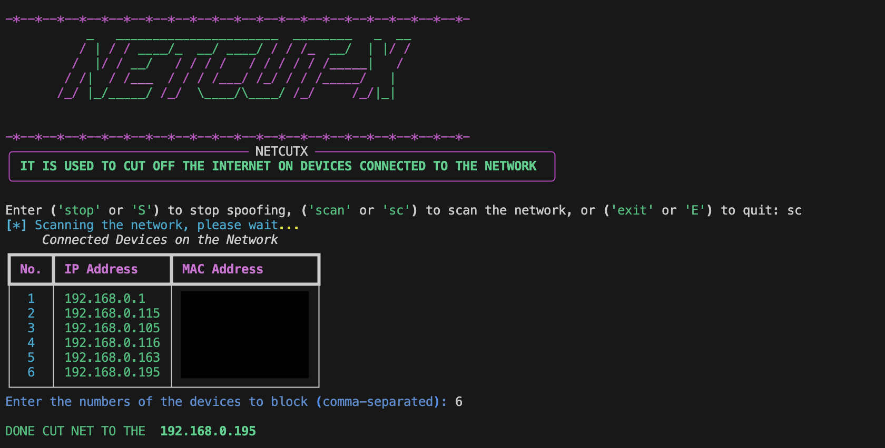

# NETCUTX

## Description
This project is designed to enable you to disconnect users from the internet on the same network.

Please try it on your own devices without harming other devices or using it on public networks.

I disclaim any responsibility for any misuse.

# Note
When this appears, which you feel is a problem, do not worry. The program will continue to work and the Internet will be cut off.
```bash
[-] Could not find MAC address for <IP Address>. Make sure the device is connected to the network.
[-] Cannot spoof; MAC address for <IP Address>. not found.
#======================== OR =========
WARNING: Mac address to reach destination not found. Using broadcast.
```
Don't worry


# setup
```bash
sudo apt install python3 -y

git clone https://github.com/cx-x1/NetCutX/

pip install -r requirements.txt

```
# Run

```bash
cd NETCUTX
sudo python main.py
```
Run script use root
## use

1 - Scan devices connected to the network
use command ```bash 
scan OR sc```

2 - select device target using Serial number


## commands:

- `scan` OR `sc` : Scan devices connected to the network
- `stop` OR `s` : stop spoofing on Device
- `exit` or `E` : Quit from Tool
  
# Tested on

- **Python:** 3.6+
- **Operating Systems:**
  - Kali Linux
  - macOS

